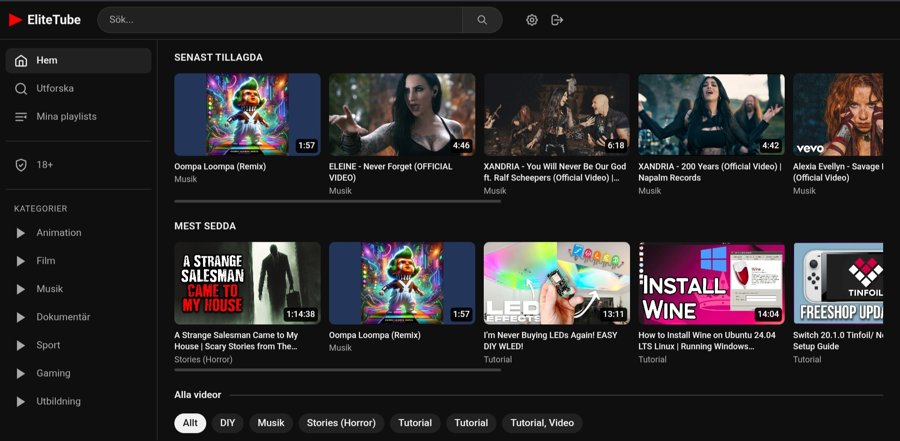
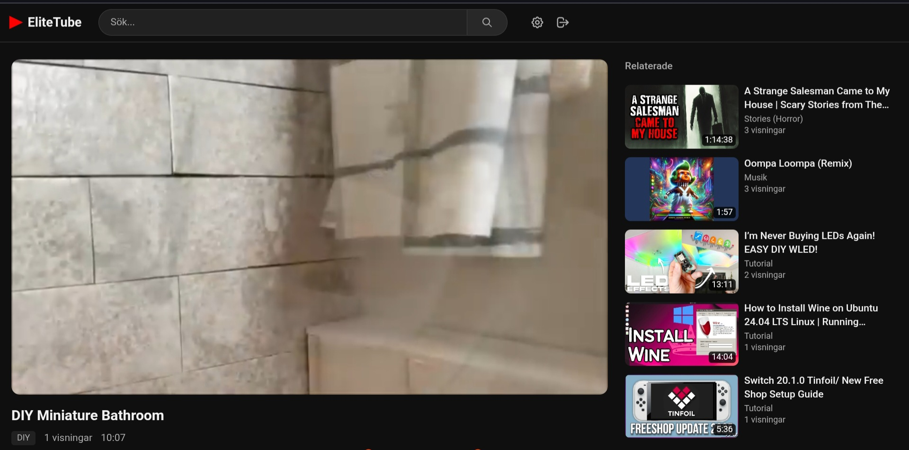
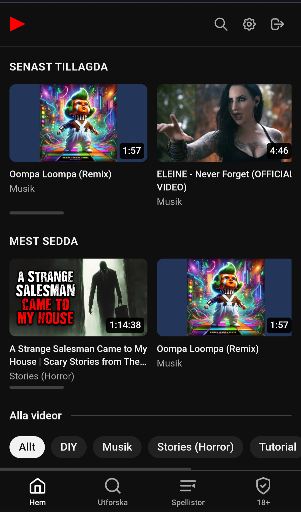
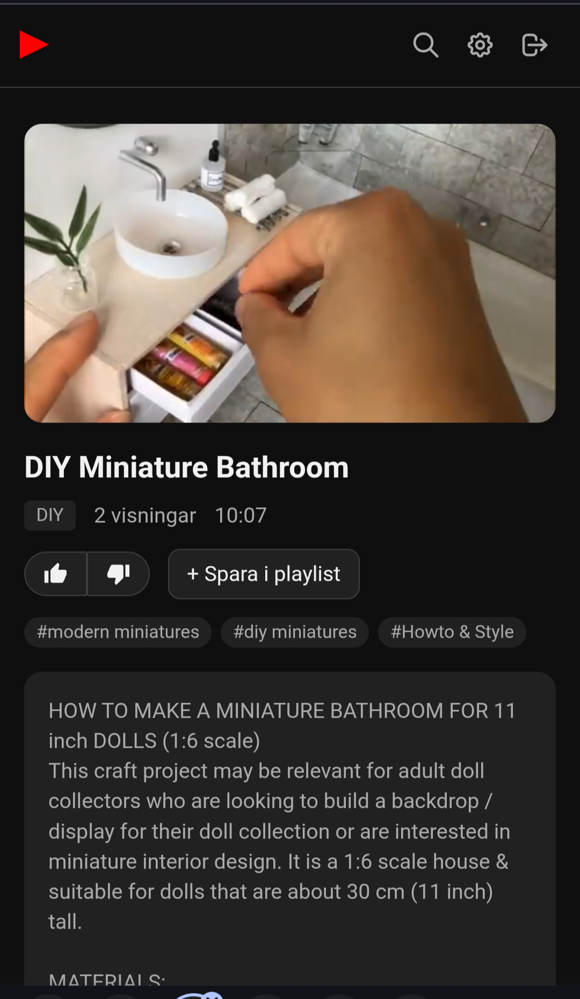

# EliteTube

Self-hosted media player built with Next.js 14. Stream local files, direct URLs and YouTube/Vimeo via yt-dlp — all in a YouTube-inspired interface.

## Features

- **Media library** — local files, direct URLs, YouTube/Vimeo via yt-dlp
- **Adult section** — separate 18+ library with PIN lock
- **Playlists** — create and play playlists with auto-next
- **Tag categories** — filter content by tags on home and search pages
- **Sort & filter** — sort by newest/most viewed/longest, filter by video length
- **Hover preview** — preview video on card hover
- **Likes/dislikes** — thumbs up/down with percentage bar
- **Playlist import** — import entire YouTube playlists with one click
- **Admin panel** — manage media, sources, tags and adult settings
- **Bulk management** — select multiple media items, fetch metadata or delete in bulk
- **Mobile-friendly** — bottom nav, full-width thumbnails, responsive layout
- **Docker-ready** — multi-stage Dockerfile with yt-dlp and ffmpeg

## Stack

- [Next.js 14](https://nextjs.org/) (App Router)
- [TypeScript](https://www.typescriptlang.org/)
- [Tailwind CSS](https://tailwindcss.com/)
- [better-sqlite3](https://github.com/WiseLibs/better-sqlite3)
- [NextAuth.js](https://next-auth.js.org/)
- [yt-dlp](https://github.com/yt-dlp/yt-dlp)

## Screenshots

### Tablet





### Mobile

<p float="left">
  
  
</p>

## Getting started

### Docker (recommended)

1. Copy the environment file and fill in your values:

```bash
cp .env.example .env
```

2. Example `docker-compose.yml`:

```yaml
services:
  elitetube:
    build: .
    container_name: elitetube
    restart: unless-stopped
    ports:
      - "3001:3001"
    volumes:
      - elitetube-data:/app/data
      - /path/to/your/media:/media:ro
    environment:
      - NEXTAUTH_SECRET=a-long-random-string
      - NEXTAUTH_URL=http://localhost:3001
      - ADMIN_PASSWORD=your-password
      - DATABASE_PATH=/app/data/elitetube.db
      - MEDIA_PATH=/media

volumes:
  elitetube-data:
```

3. Start:

```bash
docker compose up -d --build
```

Open `http://localhost:3001` and log in with username `admin` and the password you set in `ADMIN_PASSWORD`.

### Local development

Requires Node.js 20+ and yt-dlp installed.

```bash
npm install
cp .env.example .env.local
# Edit .env.local with your values
npm run dev
```

The app starts on `http://localhost:3001`.

## Environment variables

| Variable | Description | Example |
|----------|-------------|---------|
| `NEXTAUTH_SECRET` | Secret key for JWT signing | `openssl rand -base64 32` |
| `NEXTAUTH_URL` | Public URL to the app | `https://elitetube.example.com` |
| `ADMIN_PASSWORD` | Password for the admin account | `yourpassword` |
| `DATABASE_PATH` | Path to the SQLite database | `/app/data/elitetube.db` |
| `MEDIA_PATH` | Root path for local media files | `/media` |

## Media sources

Add sources under **Admin → Manage sources**:

- **Local path** — folder on the server mounted into Docker
- **SMB** — network share (mounted externally and pointed to as a local path)
- **External URL** — direct link to a media file or yt-dlp-compatible URL

## YouTube & yt-dlp setup

EliteTube uses yt-dlp to stream YouTube and other supported sites. YouTube now requires authentication to avoid bot detection, so a cookies file is needed.

### Why cookies are required

YouTube blocks requests that look automated. Providing cookies from a logged-in browser session tells YouTube the request comes from a real user.

### Exporting cookies

1. In Chrome or Edge, install the extension **[Get cookies.txt LOCALLY](https://chromewebstore.google.com/detail/get-cookiestxt-locally/cclelndahbckbenkjhflpdbgdldlbecc)**
2. Log in to YouTube
3. Go to `youtube.com`, click the extension icon and choose **Export** — save the file as `cookies.txt`

### Placing the cookies file

Copy `cookies.txt` into the Docker volume so the app can find it at `/app/data/cookies.txt`:

```bash
# Find the volume mount path
docker volume inspect elitetube-data --format '{{.Mountpoint}}'

# Copy the file (adjust the path from the command above)
sudo cp cookies.txt /var/lib/docker/volumes/elitetube-data/_data/cookies.txt
sudo chown 1001:1001 /var/lib/docker/volumes/elitetube-data/_data/cookies.txt
```

No restart or rebuild is needed — the file is read on every yt-dlp request.

### Keeping cookies fresh

YouTube cookies expire after a few weeks or when you log out. If YouTube playback stops working, export and replace the cookies file.

### Technical notes

- The Docker image uses **Node.js 20** (required by yt-dlp 2026+ for JavaScript challenge solving)
- yt-dlp uses `--remote-components ejs:github` to download YouTube's challenge solver on first use
- Cookies are passed with `--cookies /app/data/cookies.txt` on every yt-dlp call

## Adult content

1. Set a PIN code under **Admin → Adult settings**
2. Mark media as `18+` when adding or editing
3. Adult content is only shown in the 18+ section after entering the PIN

## License

Private project — not for distribution.
